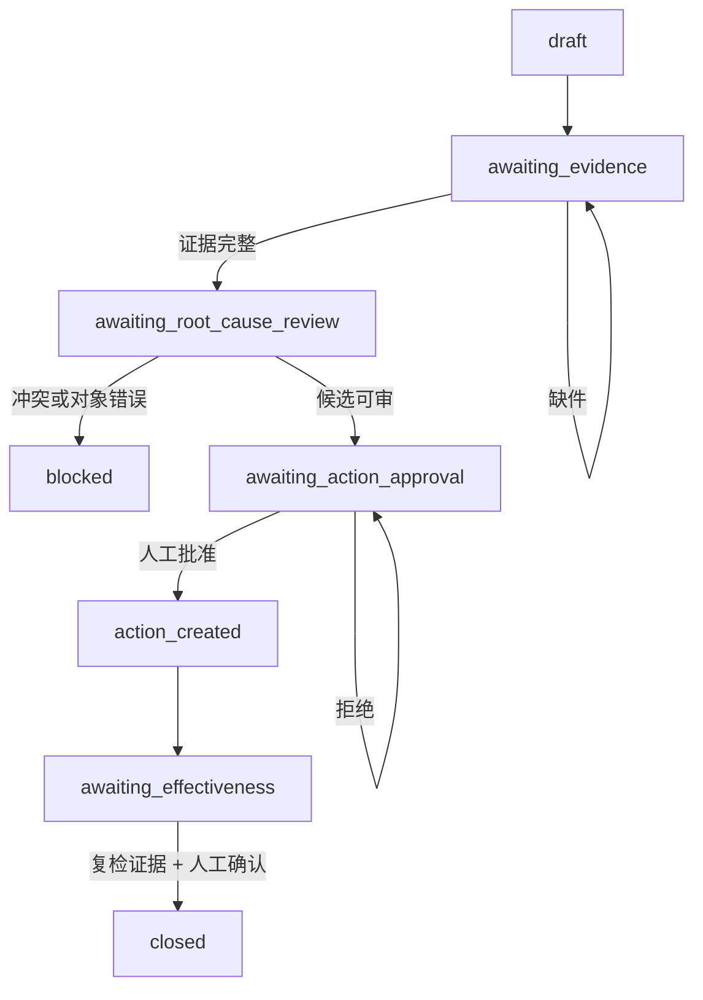

# QualityTrace 8D：可恢复的质量异常工作流

[](LICENSE)
[](requirements.txt)
[](https://github.com/IIMovoMII/qualitytrace-8d/actions/workflows/ci.yml)
[](docs/DATA_PROVENANCE_AND_SYNTHETIC_GENERATION_20260821.md)
[](docs/LLM_SEMANTIC_LAYER_20260824.md)

**QualityTrace 8D** 是一套面向制造业来料批次规格偏差的可恢复调查工作流。它把证据收集、对象核对、根因候选、结构化 8D 草稿、措施审批、工具副作用和有效性复核组织成可回放的状态图，同时把必须由人决定的节点留在流程中。可选 LiteLLM 语义层只负责整理已经通过规则核验的候选与草稿；无凭据时仍可完全离线运行。

项目解决的重点不是“让模型自动写一份 8D 报告”，而是避免证据不全却继续推进、批次对象串错、工具失败后重复建单，以及未经批准就产生外部副作用。

## 自动化了什么

- 生成结构化异常卡；
- 检查批次、规格版本、初检报告和供应商回复是否齐全；
- 识别证据冲突、错误对象、过期规格和未来证据泄漏；
- 基于可见证据生成调查计划和根因候选，再由可选 LLM 或本地回退生成结构化 8D 草稿；
- 保存运行轨迹、暂停原因、人工决定、outbox 和幂等收据；
- 在工具临时失败后从 checkpoint 恢复。

根因确认、纠正措施批准、有效性确认和最终结案不自动化。

## 业务状态图



每次状态转移保存 `run_id`、node、职责模块、工具、证据 ID、状态和暂停/错误结果。SQLite checkpoint 允许进程中断后继续；`case_id + action_version` 保证同一措施重复提交只产生一张本地收据。

## 三类职责模块

| 模块 | 负责 | 不负责 |
|---|---|---|
| Triage | 建立异常卡、检查材料和对象 | 确认根因、批准措施 |
| Investigation | 对比规格、读数和供应商回复，生成调查计划与候选 | 覆盖冲突、猜测缺失事实 |
| Draft | 用可选 LLM 将已核验候选整理为结构化 8D 草稿，失败时回退到本地草稿 | 确认根因、批准措施、自动结案 |

三个模块由确定性 LangGraph 状态图调度。它们是工作流中的职责分离，不代表三个可以绕过规则独立行动的生产 Agent。

## 可选 LLM 语义层

LLM 接入采用 BYOK，不改变离线基线。模型只能看到当前 case 的合成字段、可见 EvidenceUnit、已经由代码核验的根因候选和整改动作；未来复检证据、凭据和本地数据库不会进入请求。

```powershell
$env:QUALITYTRACE_LLM_MODEL = "openai/your-model"
$env:QUALITYTRACE_LLM_API_BASE = "https://example.invalid/v1"
$env:QUALITYTRACE_LLM_API_KEY = "<your-key>"
$env:QUALITYTRACE_LLM_RESPONSE_MODE = "json_schema"
.\run_project.ps1 llm-demo
```

`QUALITYTRACE_LLM_RESPONSE_MODE` 支持 `json_schema`、`json_object` 和 `prompt_only`。返回内容必须通过 `EightDDraftPayload` Pydantic Schema、case ID、证据白名单和人工权限状态检查。接口错误、超时、非 JSON、Schema 不合格、引用不可见证据或越过人工确认边界时只调用一次并立即回退；trace 只保存模式、错误类别和输入/输出 hash，不保存 API Key、Base URL、Prompt 或证据正文。

可选依赖由 `requirements-llm.txt` 管理；普通 `demo`、`acceptance` 和 CI 不安装 LiteLLM，也不请求任何 Provider。详细设计见 [LLM 语义层与失败回退](docs/LLM_SEMANTIC_LAYER_20260824.md)。

## 快速开始

需要 Python 3.11+。Windows 可以直接双击：

```text
run_project.cmd
```

首次运行会创建 `.venv`、安装依赖并执行默认 `acceptance`。

手动运行：

```powershell
git clone https://github.com/IIMovoMII/qualitytrace-8d.git
cd qualitytrace-8d
py -3.11 -m venv .venv
.\.venv\Scripts\python.exe -m pip install -r requirements.txt
$env:PYTHONPATH = (Join-Path (Get-Location) 'src')
.\.venv\Scripts\python.exe -m qualitytrace.cli demo
.\.venv\Scripts\python.exe -m qualitytrace.cli acceptance
.\.venv\Scripts\python.exe -m qualitytrace.cli check-data
```

其他命令：

```powershell
.\run_project.ps1 demo
.\run_project.ps1 acceptance
.\run_project.ps1 check-data
.\run_project.ps1 generate-data
```

`check-data` 只核对生成数据、关系和 hash，不改文件；`generate-data` 才会按固定 seed 重建数据集。

## 可复现合成数据

冻结数据集 `QT8D-SYNTHETIC-20260821-A` 包含：

- `1` 个来料尺寸偏差母案例；
- `5` 条受控路径：完整、缺件、冲突、错误对象、工具失败恢复；
- `3` 条只作调查参考的合成历史案例；
- `6` 份合成内部规则；
- `25` 份独立证据文件。

母案例规格为 `10.00 ± 0.05 mm`。初检 5 件中 2 件超上限；纠正后复检 5 件均在规格内。每个异常路径只修改一个受控变量，复检文件在初始调查阶段不可见，防止用未来结果倒推根因。

数据由 seed `20260821` 的本地生成器产生，输入、输出和规则 hash 写入 manifest。字段关系参考 ERPNext，生成/过滤方法参考 DataFlow，元数据和约束方法参考 SDV，具体业务值、案例、规则和证据均为本项目原创合成内容。

完整来源与许可证边界见[数据来源与合成说明](docs/DATA_PROVENANCE_AND_SYNTHETIC_GENERATION_20260821.md)。

## 失败安全

- **缺少证据**：停在 `awaiting_evidence`；
- **证据冲突**：进入 `blocked`；
- **对象不一致**：进入 `blocked`；
- **只读工具临时失败**：有限重试后从 checkpoint 继续；
- **LLM 接口或结构化输出失败**：单次尝试后回退到本地 8D 草稿，业务状态和人工门禁不变；
- **未经授权的措施**：不进入 outbox；
- **重复提交**：返回同一幂等收据；
- **有效性证据不足**：不能关闭 case。

## 验证记录

当前 provider-free 离线套件为 `19 passed`：原 13 项覆盖五条业务路径、生成确定性、manifest hash、规则引用、受控变体隔离、未授权审批、初检/复检样本不足、未来证据隔离、outbox、幂等与工具失败恢复；新增 6 项覆盖结构化 LLM 成功路径、非 JSON、接口失败、证据越界、权限越界和 LiteLLM JSON Schema 请求合同。测试使用 fake provider，不请求真实模型。

```powershell
$env:PYTHONPATH = (Join-Path (Get-Location) 'src')
.\.venv\Scripts\python.exe -m pytest -q
.\run_project.ps1 acceptance
```

## 参考项目与实际改造范围

- [LangGraph](https://github.com/langchain-ai/langgraph) 提供状态图与 checkpoint 编排底座。
- [ERPNext](https://github.com/frappe/erpnext) 用于参考质量对象和字段关系；[DataFlow](https://github.com/OpenDCAI/DataFlow) 与 [SDV](https://github.com/sdv-dev/SDV) 用于参考合成数据的生成、过滤、约束和元数据方法。

QualityTrace 自行实现 8D 状态门禁、证据可见性、SQLite 审计轨迹、人工审批、outbox、幂等收据和五条受控路径。仓库没有复制参考项目的业务数据或案例；全部规则、异常记录和证据文件均为可追溯的原创合成内容。

## 项目结构

```text
src/qualitytrace/       Schema、政策、工具、持久化、状态图、LLM 语义层和验收
src/qualitytrace/agents 三类职责模块
data/policies/          6 份合成内部规则
data/generated/         5 条路径、3 条历史和 25 份证据
tests/                  provider-free 离线测试
scripts/                数据生成与公开提交安全审计
artifacts/              本地 SQLite、trace 和报告；不进入 Git
```

## 公开安全审计

```powershell
git add -A
.\.venv\Scripts\python.exe .\scripts\audit_public_commit.py
```

审计只报告规则、路径和行号，不显示疑似凭据原文。更多边界见 [SECURITY.md](SECURITY.md)。

## 边界

QualityTrace 8D 是个人 POC，不接真实 MES/ERP，不代表真实工厂、客户、生产部署或效率收益。当前实现使用本地 LangGraph + SQLite，并提供可选 LiteLLM BYOK 语义层；离线测试验证了适配合同和失败回退，但未把 fake provider 结果表述为真实模型运行。模型不能替代质量负责人的正式决定。

## License

[MIT License](LICENSE)
